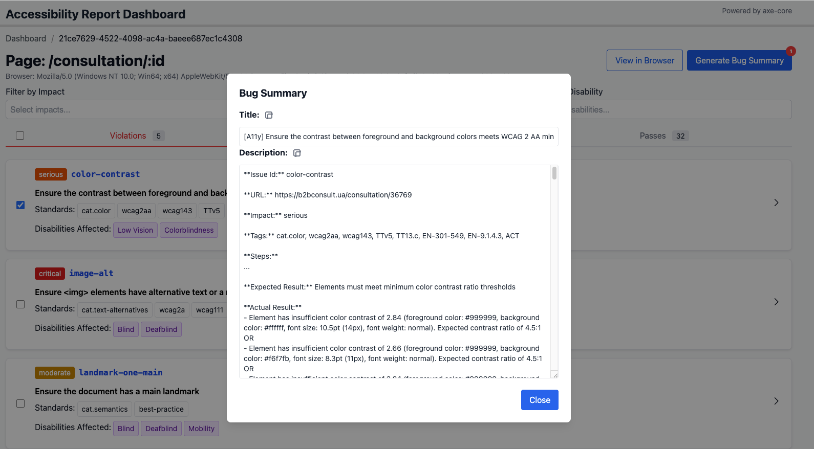
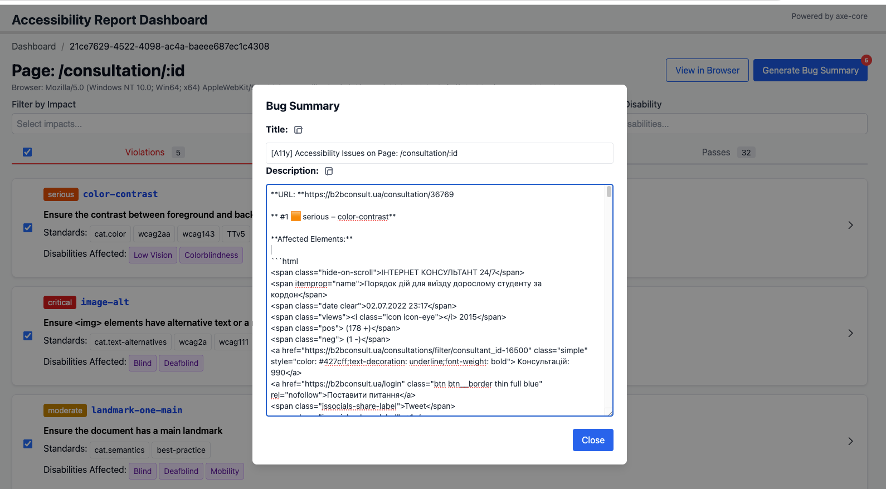

# axe-playwright-report

[](https://www.npmjs.com/package/axe-playwright-report)

Open-source library for generating accessibility dashboard reports with Playwright and axe-core.


## Main Aim

The primary goal of this library is to enhance standard UI automation tests and the Page Object Pattern by enabling integrated accessibility scans. Instead of maintaining separate accessibility tests—which often duplicate the structure of regular UI tests—this library lets you trigger accessibility checks directly within your existing test flows. This approach reduces maintenance overhead when test flows change, as accessibility scans can be performed at any point in your current tests without the need for dedicated accessibility test cases.

#### ℹ️ Reasonable Remark:
> q: Page object methods are reused in multiple tests, which will create multiple reports for the same page.
>
> a: During dashboard generation, the library will automatically de-duplicate results and retain only the scan with the most accessibility issues for each page.

## Features

- **Playwright + axe-core integration**: Easily scan your web pages for accessibility issues during Playwright tests.
- **Dashboard report**: Generates a filterable HTML dashboard summarizing all accessibility findings.
- **Customizable**: Configure scan options, output directory, and screenshot capture.
- **Reuse of UI automation tests**: Leverage existing Page Object Pattern methods to run accessibility scans without duplicating test logic.

## What This Library Offers

1. **@axeScan() decorator**: Runs an accessibility scan after the method body is executed, allowing you to integrate accessibility checks seamlessly into your existing test methods.
2. **build-report command**: Generates a dashboard report with backward compatibility for reports generated with axe-core/playwright.
3. **pass-fail command**: enforces strict build rules in CI/CD pipelines.

## Installation

```bash
npm install axe-playwright-report --save-dev
```

## Usage

### 1. Decorate your Playwright test methods

```typescript
import { axeScan } from 'axe-playwright-report';

class MyTest {
    page: Page;

    constructor(page: Page) {
        this.page = page;
    }

    @axeScan()
    async testHomePage() {
        await this.page.goto('https://example.com');
        // ... your test logic ...
    }
}
```

- The `@axeScan()` decorator will run an accessibility scan after the decorated method.
- Results are saved as JSON in the output directory (default: `axe-playwright-report/pages`).


> ### ⚠️ **Limitations**
> The Page Object Class must contain an object of type `Page`. If you decompose the page and use `Locator` as a base for searching elements, the accessibility scan will be skipped.
>
> **Applicable ✅**: `new sideMenu(page)`
>
> **Not-applicable ❌**: `new sideMenu(page.locator('#sideMenu'))`

### 2. Configure scan options (optional)

Having accessibility env file gives you the flexibility to customize your scan settings.
With the config file it allows:
- enable/disable scanning (default: `on`)
- custom output directory (default: `axe-playwright-report`)
- enable/disable screenshots capture (default: `off`)
- filter rules by axe-core tags (default: `no filtering, all rules included`)
- merge reports strategy (default: `best`)
    - `none` - keep all reports,
    - `exact` - merge only identical reports,
    - `best` - keeps the report with the most accessibility issues
- use custom regular expression for improving page normalization algorithm
    - pass a list of regular expressions in array format '["regExp1", "regExp2"]'
- and all configuration options from axe-core, such as:
    - `tags` - running access specific WCAG success criteria
    - `withRules` - specify a list of rules to run
    - `excludeRules` - specify a list of rules to exclude from running
    - `include` - constrain an accessibility scan to only run against one specific part of a page
    - `exclude` - exclude the specified elements and all of their descendants

Create a `.env.a11y` file in your project root:

```
SCAN=on
OUTPUT_DIR=custom-report-dir
MERGE_STRATEGY=best
SCREENSHOT=on
CUSTOM_REG_EXP='["^\/\w+-\w+-\w+\.html$", "\/([^\/]*-[^\/]*)"]'
TAGS=wcag2a,wcag2aa
WITH_RULES=color-contrast,image-alt
EXCLUDE_RULES=link-in-text-block
INCLUDE='.main-content'
EXCLUDE='.main-content .footer'
```

- `SCAN`: Set to `on` to enable scanning.
- `OUTPUT_DIR`: Directory for report output (default: `axe-playwright-report`).
- `SCREENSHOT`: Set to `on` to capture screenshots of issues.
- `TAGS`: Comma-separated list of axe-core tags to filter rules.
- `WITH_RULES`: Comma-separated list of axe-core rule IDs to run.
- `EXCLUDE_RULES`: Comma-separated list of axe-core rule IDs to exclude from running.
- `INCLUDE`: Selector to constrain an accessibility scan to only run against one specific part of a page.
- `EXCLUDE`: Selector to exclude the specified elements and all of their descendants.
- `MERGE_STRATEGY`: Set to `none` to keep all reports, `exact` to merge only identical reports, `best` to keep the report with the most accessibility issues.
- `CUSTOM_REG_EXP`: Custom regular expression for improving page normalization algorithm.

You can find example of `.env.a11y` file [here](./.env.a11y.example)

#### Recommendation for custom RegExp
By default, the library uses a normalization algorithm to avoid duplicate reports for the same page, for example, UUID, numeric or alphanumeric IDs.  
If you have a specific page structure not normalized by the default algorithm, you can use the `CUSTOM_REG_EXP` option to improve the results. 
Follow the structure of how the library operates with the regular expression.
Examples:
```
- CUSTOM_REG_EXP='["^\/\w+-\w+-\w+\.html$", "\/([^\/]*-[^\/]*)"]'
- CUSTOM_REG_EXP='["^\/\w+-\w+-\w+\.html$"]
```


### 3. Generate the dashboard report

After running your tests, build the dashboard:

```bash
npx axe-playwright-report build-report
```

This will generate an interactive HTML dashboard in your output directory.

> #### Backward Compatibility with Axe-core/playwright
> if you have existing reports generated with axe-core/playwright, you can still use this library to build the dashboard.
> Just place your existing JSON report files in the `axe-playwright-report/pages` directory and run the `build-report` command.

## Output

- **Dashboard**: `index.html` and supporting files in your output directory.
- **Per-page results**: JSON files for each scanned page.
- **Screenshots**: PNGs highlighting issues (if enabled).

## Generating Bug Summary Reports

You can generate bug summary reports directly from the report page for selected accessibility issues.  
This feature allows you to quickly create bug reports with pre-filled titles and descriptions, saving time on repetitive reporting tasks.  
Based on the number of selected issues, it generates either a single bug report for each issue or a grouped report for multiple issues.

#### Single Bug Report Example

#### Grouped Bug Report Example



## Playwright Custom Reporter
Using the Playwright custom reporter, you can generate an accessibility report after test run automatically.  
To enable this feature, add the following code to your `playwright.config.ts` file:
```typescript
import { defineConfig } from '@playwright/test';

export default defineConfig({
    reporter: [
        ['axe-playwright-report/axeBuildReport',
            {
                softAssert: true // if true, the process will not fail if there are accessibility issues. Default: false.
            }
        ],
    ],
});
```
`softAssert` parameter is optional and used for controlling the 'test' command behavior within the following cases:
- `true`: the process will fail if there are accessibility issues.
- `false`: the process will not fail if there are accessibility issues.
- not specified: the test command will be not initiated, a process will not fail if there are accessibility issues.


## axe-playwright-report CLI
There are two commands available in the CLI:
- `build-report`: Generates a dashboard report.
- `merge-reports`: Merges multiple reports into a single report. This command is integrated into the `build-report` command. As the separate command will be useful when you run tests in parallel using Playwright Sharding.
- `test`: Check accessibility baselines.


### Example Report

Below is an example of the generated dashboard report:


## License

MIT